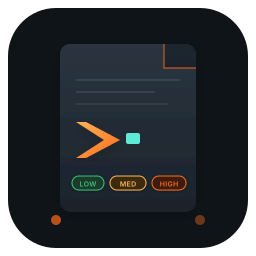
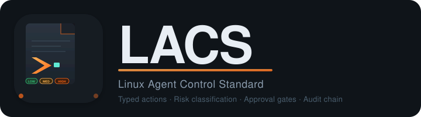

<div align="center">





**Typed actions · Risk classification · Approval gates · Audit chain**

[](LICENSE)
[](spec.md)
[](#versioning)
[](https://github.com/lacs-foundation/specification/issues)

---

[What is LACS?](#what-is-lacs) · [Core Concepts](#core-concepts) · [Specification](#specification) · [Implementations](#implementations) · [Versioning](#versioning) · [Contributing](#contributing) · [License](#license)

</div>

---

## What is LACS?

**LACS** (Linux Agent Control Standard) is an open protocol for AI agents that operate at the Linux system level.

Every current AI system agent operates on raw shell text: the agent generates a command, the shell runs it, and the user finds out what happened after. There is no formal model of what "safe" means — no type system, no mandatory review, no audit trail.

LACS defines that model.

It specifies how an **AI planning layer**, a **user-facing approval layer**, and a **privileged execution layer** interact — with typed actions, formal risk levels, mandatory approval gates, and an immutable audit trail.

> LACS is to AI system agents what MCP is to AI tool integration: a standard interface so that safety properties can be verified, audited, and built upon — rather than re-invented (incorrectly) by each implementation.

---

## Core Concepts

### Typed actions, not shell commands

A LACS action is a named, structured operation with a declared parameter schema — not a string of bytes handed to `/bin/sh`. The executor knows what `AddLayeredPackage` *is*: what it will do, how to preview it, and how to roll it back.

### Formal risk levels

Every action carries a risk level enforced by the executor, not suggested to the user.

| Risk Level | Semantics | Approval Required |
|:---:|---|---|
| `Low` | Read-only, no side effects | None — executes silently |
| `Medium` | Reversible side effect | Yes / No confirmation |
| `High` | Irreversible or access-control mutation | Must type the action name |

### Privilege separation

Three processes, three trust levels, one direction of trust:

```
Planner  ──→  Shell  ──→  Daemon
(untrusted)  (user)   (privileged)
```

The **Planner** proposes. The **Shell** approves. The **Daemon** executes.  
The Planner never touches the Daemon.

### Immutable audit trail

Every execution is logged with the action name, parameters, risk level, approval mode, status, and timestamps. Append-only. No deletions.

---

## Specification

The full protocol is in **[spec.md](spec.md)** (version 2026-04-15).

The specification uses [RFC 2119](https://www.rfc-editor.org/rfc/rfc2119) language (MUST, SHOULD, MAY) for normative requirements. It covers:

- Action type registry and parameter schemas
- Risk-level classification rules
- Approval gate semantics
- Audit log format and integrity requirements
- Planner ↔ Shell ↔ Daemon IPC protocol
- Conformance requirements for each layer

---

## Implementations

### Reference implementation

| Project | Language | Target | Status |
|---|---|---|---|
| [**SysKnife**](https://github.com/lacs-foundation/sysknife) | Rust | Fedora Atomic Desktops | Active |

SysKnife is the canonical implementation of the LACS protocol. It ships `sysknife-brain` (planner), `sysknife-shell` (approval UI), and `sysknife-daemon` (privileged executor) — each in a separate crate with no cross-layer trust blurring.

### Other distros / languages

LACS is designed to be portable. If you are building a LACS-conforming implementation for another distribution (Ubuntu, Arch, NixOS, openSUSE, …) or in another language (Python, Go, TypeScript, …), open a PR to add it here.

Conformance requirements are in [spec.md §9](spec.md).

---

## Versioning

Spec versions use a `YYYY-MM-DD` date stamp. A new date stamp is issued when:

- A normative requirement changes (MUST / MUST NOT / SHOULD)
- A new action type is added to the registry
- The audit log schema changes

Non-normative clarifications and typo fixes are made in place without bumping the version. The current version is **2026-04-15**.

Implementation compatibility: an implementation that conforms to version `V` MAY also accept plans generated against any earlier version, but MUST reject plans that require a later version's features.

---

## Contributing

LACS is an open protocol. Contributions are welcome via issues and pull requests.

- **Found an ambiguity?** Open an issue with the section number and the two interpretations you see.
- **Building a conforming implementation?** Open a PR to add it to the [Implementations](#implementations) table.
- **Proposing a new action type or concept?** Start with an issue to align on semantics before drafting a spec change.
- **Language / clarity improvements?** PRs welcome — the spec should be unambiguous and readable.

All contributions to the specification text are made under CC0 — no CLA required.

---

## License

LACS specification — [CC0 1.0 Universal](LICENSE) (public domain dedication)

You may copy, modify, distribute, and implement this specification without asking permission. Attribution appreciated but not required.
